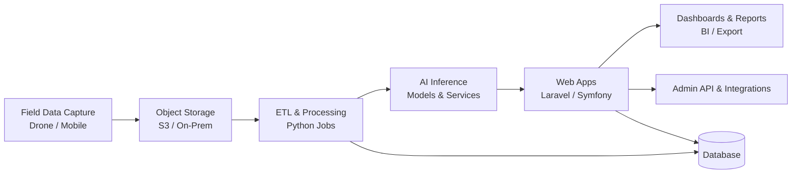

<h1 align="center">Muhamad Arwin Wijaya</h1>

<strong>Solution Engineer Analyst at Great Giant Foods</strong>

  Building AI-driven web systems, cloud platforms, and automation
  to deliver measurable operational impact.

  
  
  

---

## 📌 Highlights
- **Applied AI Solutions:** Delivering AI-powered systems for agriculture, including drone-based analytics, object counting, sizing, and early warning use cases.
- **Platform & Delivery:** Building and operating production-ready web platforms with CI/CD, containerization, and cloud or on-premise deployment models.
- **Business Impact:** Translating operational data into dashboards, insights, and decision-support tools for measurable business outcomes.

---

## 🔧 What I work on
- **AI for Agriculture** — Designing and implementing applied AI solutions for monitoring, detection, counting, sizing, and operational early warning.
- **Data & Machine Learning** — Developing data pipelines, predictive models, and analytics workflows using Python and modern machine learning tooling.
- **Cloud & DevOps** — Managing application delivery through AWS, Docker, CI/CD pipelines, and reliable deployment practices across environments.
- **Web Applications** — Building business-focused web applications and backend services with Laravel, Symfony, and REST API architectures.

---

## 📈 Activity
**What it shows:** consistency and delivery cadence across projects.

<table align="center">
  <tr>
    <td colspan="2" align="center"></td>
  </tr>
  <tr>
    <td colspan="2" align="center"></td>
  </tr>
  <tr>
    <td colspan="2" align="center"></td>
  </tr>
  <tr>
    <td colspan="2" align="center"></td>
  </tr>
</table>

  

  

---

## ⚙️ DevOps & Engineering
**What it shows:** engineering footprint and languages used in production work.

**Core Tech Stack**

---

## 🏗️ Architecture (High-level)
**What it shows:** end-to-end flow from data capture to insight delivery.

---

## 🤖 AI (Applied)
**What it shows:** a practical approach to AI that prioritizes operational value, reliability, and adoption in real business environments.

- Business-oriented model evaluation using metrics aligned with operational outcomes and decision quality
- Deployment readiness through monitoring, validation, iteration, and integration into production workflows
- End-to-end implementation that connects AI services with web applications, dashboards, and reporting layers

---

## 🚀 Current Focus
- Scaling AI-enabled web platforms for production and enterprise use
- Improving data pipeline reliability, system observability, and deployment efficiency
- Strengthening the connection between analytics, machine learning, and business decision-making

---

## 📫 Reach me
- **Email:** muhamad.arwinwijaya@gmail.com
- **LinkedIn:** https://www.linkedin.com/in/muhamadarwinwijaya/
- **Portfolio:** https://marwinwijaya.github.io
